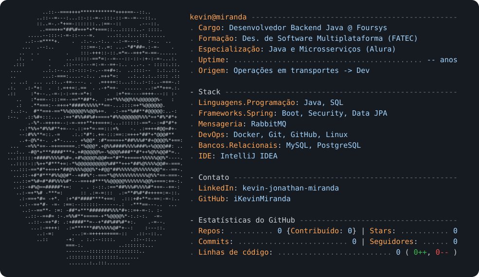

<div align="center">

<a href="https://github.com/iKevinMiranda">
  <picture>
    <source media="(prefers-color-scheme: dark)" srcset="dark_mode.svg">
    <source media="(prefers-color-scheme: light)" srcset="light_mode.svg">
    
  </picture>
</a>

<p>
  <a href="https://www.linkedin.com/in/kevin-jonathan-miranda/">
    
  </a>
  
  
  
  
  
</p>

</div>

---

## 💻 Sobre mim

> Migrei de **operações em transportes** para **desenvolvimento de software** depois de descobrir, na prática, que tecnologia era onde eu queria estar.

```java
public class KevinMiranda {
    private String role = "Desenvolvedor Backend Java";
    private String company = "Foursys";
    private String[] stack = {"Java", "Spring Boot", "Microsserviços", "RabbitMQ", "Docker"};
    private boolean openToConnect = true;

    public static void main(String[] args) {
        System.out.println("Bora trocar uma ideia sobre tecnologia? 🚀");
    }
}
```

* ☕ **Java & Spring Boot** — APIs REST, Spring Security, Spring Data JPA
* 🐳 **Docker** — Containerização e deploy de microsserviços
* 📨 **RabbitMQ** — Mensageria assíncrona entre serviços
* 🗄️ **PostgreSQL / MySQL** — Modelagem e otimização de queries
* 🎓 **Des. de Software Multiplataforma** — FATEC
* 📚 **Especializações** — Java & Microsserviços (Alura)

---

## 🛠️ Stack Principal

<p align="center">
  
</p>

---

## 📌 Projetos em Destaque

| Projeto | Descrição | Stack |
|---------|-----------|-------|
| [github-profile](https://github.com/iKevinMiranda/iKevinMiranda) | Profile README dinâmico com GitHub Actions | Markdown, GitHub Actions, SVG |
| *(adicionar seus projetos públicos aqui)* | | |

> **Dica:** Pin 3-5 repos públicos relevantes no perfil. Cada pinned repo deve ter README próprio com quickstart.

---

## 📬 Contato

<p align="center">
  <a href="https://www.linkedin.com/in/kevin-jonathan-miranda/">
    
  </a>
</p>

<p align="center">✉️ Aberto a conversas sobre tecnologia, arquitetura e oportunidades.</p>

---

### 🐍 Atividade de Contribuição

<p align="center">
  <picture>
    <source media="(prefers-color-scheme: dark)" srcset="https://raw.githubusercontent.com/iKevinMiranda/iKevinMiranda/output/github-contribution-grid-snake-dark.svg">
    <source media="(prefers-color-scheme: light)" srcset="https://raw.githubusercontent.com/iKevinMiranda/iKevinMiranda/output/github-contribution-grid-snake.svg">
    
  </picture>
</p>